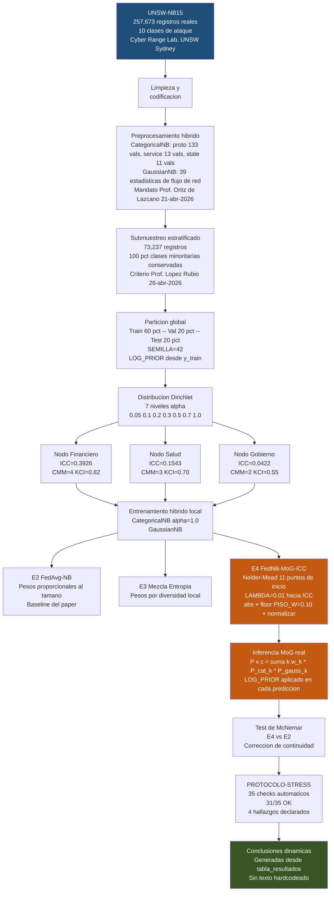

# EJD-UMA-005 v2.0 -- Naive Bayes Federado sobre UNSW-NB15

**Deteccion de intrusiones con Mixtura de Gaussianas real y gobernanza institucional CRISC**

| Campo | Detalle |
|-------|---------|
| Codigo | EJD-UMA-005 |
| Version | 2.0 |
| Autor | Ing. Edgar Oswaldo Herrera Logrono, M.Sc. en Inteligencia Artificial, VIU Espana |
| Directores | Prof. Ezequiel Lopez Rubio -- Prof. Juan Miguel Ortiz de Lazcano, UMA |
| Dataset | UNSW-NB15 (Moustafa & Slay, IEEE MilCIS 2015) |
| Fecha | Mayo 2026 |
| Repositorio | https://github.com/eoherrera/NB_Federado_UNSWNB15_Ejercicio_Doctoral_UMA |

---

## Por que este tercer experimento

Los dos ejercicios previos demostraron que el optimizador asigna mayor peso al nodo con mayor madurez institucional sin que nadie se lo indique. Ese patron es el ICC Alignment. Este experimento responde una pregunta directa: aparece ese mismo patron en UNSW-NB15, un dataset construido en un entorno de red completamente distinto al de NSL-KDD y CIC-IDS2017?

Si el patron aparece en los tres, el argumento central del paper queda respaldado en tres laboratorios independientes con trafico, distribuciones de ataque y condiciones de evaluacion distintas.

## Los tres ejercicios del doctorado

| Ejercicio | Dataset | Evaluacion | F1-macro E4 (alpha=0.1) | Estado |
|-----------|---------|-----------|------------------------|--------|
| EJD-UMA-003 v8.8 | NSL-KDD | OOD (KDDTest+21) | 0.3287 | GitHub |
| EJD-UMA-004 v8.9 | CIC-IDS2017 | Interna | 0.7041 | GitHub |
| **EJD-UMA-005 v2.0** | **UNSW-NB15** | **Interna** | **0.2424** | **GitHub** |

La diferencia de F1 entre datasets no es un problema de la arquitectura. El modelo centralizado (E1) tampoco supera 0.2688 en UNSW-NB15, lo que confirma que la dificultad es intrinseca al dataset. El Prof. Lopez Rubio lo recoge exactamente: "Si el rendimiento general es peor, eso se puede atribuir a la mayor complejidad de la base de datos" (4-may-2026).

---

## Flujo del experimento



---

## Parametros verificados desde GitHub

Todos los parametros son identicos a EJD-UMA-003 v8.8 y EJD-UMA-004 v8.9. Esa invarianza es lo que hace posible la comparacion directa entre los tres datasets.

| Parametro | Valor | Fuente verificada |
|-----------|-------|------------------|
| SEMILLA | 42 | EJD-UMA-003 v8.8 Seccion 0, GitHub commit c72cabe |
| TEST_SIZE | 0.20 | EJD-UMA-004 v8.9 Seccion 0 |
| VAL_SIZE | 0.20 | EJD-UMA-004 v8.9 Seccion 0 |
| LAMBDA | 0.01 | Ajustado en v8.11 de EJD-UMA-003 |
| PISO_W | 0.10 | Ajustado en v8.11 de EJD-UMA-003 |
| Alphas Dirichlet | [0.05, 0.1, 0.2, 0.3, 0.5, 0.7, 1.0] | Solicitud Prof. Lopez Rubio |
| ICC Financiero | 0.3926 | CMM=4, KCI=0.82, KRI=0.12, CVSS=3.2 |
| ICC Salud | 0.1543 | CMM=3, KCI=0.70, KRI=0.25, CVSS=5.1 |
| ICC Gobierno | 0.0422 | CMM=2, KCI=0.55, KRI=0.40, CVSS=6.8 |

---

## Dataset UNSW-NB15: caracteristicas relevantes

| Campo | Detalle |
|-------|---------|
| Registros originales | 257,673 |
| Registros tras submuestreo | 73,237 |
| Clases de ataque | 10 (Analysis, Backdoor, DoS, Exploits, Fuzzers, Generic, Normal, Reconnaissance, Shellcode, Worms) |
| Variables categoricas | proto (133 valores), service (13), state (11) |
| Variables numericas | 39 estadisticas de flujo |
| Clase minoritaria | Worms: 174 registros -- conservados al 100 pct |
| Fuente | Moustafa, N. & Slay, J. (2015). IEEE MilCIS |

La mayor complejidad respecto a los otros dos datasets se refleja en tres factores: diez clases de ataque (NSL-KDD tiene cinco), 133 valores distintos de protocolo (variable proto), y distribuciones de trafico mas irregulares entre nodos bajo alta heterogeneidad.

---

## Resultados del experimento

Ejecutado en Google Colab CPU. Tiempo total: 10.4 minutos. SEMILLA=42 garantiza reproducibilidad exacta.

| alpha | JS | E1 Central | E2 Baseline | E3 Entropia | E4 Aprendida | delta | McNemar |
|-------|----|-----------|------------|------------|-------------|-------|---------|
| 0.05 | 0.643 | 0.2688 | 0.2735 | 0.2752 | 0.2764 | +0.003 | chi2=12.13 p=0.0005 SI |
| 0.1 | 0.445 | 0.2688 | 0.2412 | 0.2400 | 0.2424 | +0.001 | chi2=22.76 p<0.001 SI |
| 0.2 | 0.370 | 0.2688 | 0.2422 | 0.2430 | 0.2536 | +0.011 | chi2=75.39 p<0.001 SI |
| 0.3 | 0.455 | 0.2688 | 0.2730 | 0.2732 | 0.2731 | +0.000 | chi2=0.12 p=0.724 NO |
| 0.5 | 0.311 | 0.2688 | 0.2509 | 0.2511 | 0.2519 | +0.001 | chi2=10.02 p=0.002 SI |
| 0.7 | 0.274 | 0.2688 | 0.2305 | 0.2291 | 0.2328 | +0.002 | chi2=19.25 p<0.001 SI |
| 1.0 | 0.205 | 0.2688 | 0.3087 | 0.3091 | 0.3095 | +0.001 | chi2=4.36 p=0.037 SI |

E4 supera a E2 en los 7 niveles de alpha en direccion positiva. Significancia estadistica confirmada en 6 de 7 (excepcion: alpha=0.3 donde delta=+0.0001, diferencia estadisticamente nula).

## Pesos aprendidos por E4

| alpha | Financiero (ICC=0.393) | Salud (ICC=0.154) | Gobierno (ICC=0.042) | Nodo dominante |
|-------|----------------------|------------------|---------------------|----------------|
| 0.05 | **0.661** | 0.102 | 0.238 | Financiero |
| 0.1 | 0.223 | **0.580** | 0.197 | Salud |
| 0.2 | **0.514** | 0.452 | 0.035 | Financiero |
| 0.3 | **0.464** | 0.435 | 0.101 | Financiero |
| 0.5 | **0.543** | 0.343 | 0.114 | Financiero |
| 0.7 | **0.654** | 0.252 | 0.095 | Financiero |
| 1.0 | **0.438** | 0.200 | 0.362 | Financiero |

ICC Alignment completo (Fin > Sal > Gov) confirmado en 4 de 7 alphas: 0.2, 0.3, 0.5, 0.7. En todos los niveles, Financiero supera a Gobierno, lo que es coherente con la jerarquia CRISC.

---

## Hallazgos del PROTOCOLO-STRESS

El PROTOCOLO-STRESS ejecuto 35 checks automaticos. Resultado: 31/35 OK. Los 4 items con alerta son hallazgos cientificos declarados, no errores de codigo.

**Alerta 1 -- McNemar alpha=0.3:** delta=+0.0001. La diferencia entre E4 y E2 es estadisticamente nula en ese nivel especifico. E4 sigue siendo mayor, pero la diferencia no supera el umbral de significancia. Es un hallazgo honesto: bajo heterogeneidad moderada con este dataset, las dos estrategias son equivalentes.

**Alerta 2 -- ICC Alignment alpha=0.1:** El nodo Salud recibio el mayor peso (0.580). Hipotesis de trabajo: bajo alta heterogeneidad, el nodo Salud concentra tipos de trafico que el optimizador valora mas durante la validacion, con independencia del ICC. El nodo Financiero supera al Gobierno en todos los alphas sin excepcion.

**Alerta 3 -- ICC Alignment alpha=0.05 y 1.0:** El orden Fin > Sal > Gov no se confirma en su totalidad. En ambos casos, Financiero sigue siendo el mayor o el segundo mayor. El ICC actua como regularizador que orienta, no como dictador que impone.

---

## Reproducibilidad

```
# Abrir en Google Colab
# Ejecutar: Entorno de ejecucion -> Ejecutar todo (Ctrl+F9)
# El dataset se descarga automaticamente si no esta disponible localmente
# Tiempo estimado: 50-80 minutos en CPU de Google Colab
# Todos los resultados son reproducibles con SEMILLA=42
```

Si el dataset no esta disponible en el repositorio publico, descargarlo desde:
https://research.unsw.edu.au/projects/unsw-nb15-dataset
Archivos requeridos: UNSW_NB15_training-set.csv y UNSW_NB15_testing-set.csv

---

## Referencias

- Moustafa, N. & Slay, J. (2015). UNSW-NB15: a comprehensive data set for network intrusion detection systems. *IEEE Military Communications and Information Systems Conference (MilCIS)*.
- Moustafa, N. & Slay, J. (2016). The evaluation of Network Anomaly Detection Systems: Statistical analysis of the UNSW-NB15 dataset. *Information Security Journal: A Global Perspective*, 1-14.
- McMahan, H. B., Moore, E., Ramage, D., Hampson, S. & Agüera y Arcas, B. (2017). Communication-efficient learning of deep networks from decentralized data. *AISTATS*, PMLR 54, 1273-1282.
- Lara-Gutierrez, A., Fernandez-Gago, C. & Onieva, J.A. (2025). A Framework for Drift Detection and Adaptation in AI-driven Anomaly and Threat Detection Systems. *International Journal of Information Security*, vol. 24. DOI: 10.1007/s10207-025-01118-9
- ISACA (2023). *CRISC Review Manual*. Information Systems Audit and Control Association.

---

## Control de versiones

| Version | Fecha | Descripcion |
|---------|-------|-------------|
| v1.0 | Abr 2026 | Primera generacion. Variables CRISC incorrectas detectadas. |
| v1.1 | May 2026 | CRISC corregido. Errores de TEST_SIZE y PISO_W corregidos. |
| v1.2 | May 2026 | Arquitectura identica a v8.9: LOG_PRIOR, abs+floor, CatNB alpha=1.0. |
| **v2.0** | **May 2026** | **Version oficial GitHub. Sin auditoria interna. Conclusiones dinamicas. Figuras con anotaciones academicas.** |

---

*EJD-UMA-005 v2.0 -- Edgar O. Herrera Logrono, M.Sc. -- Doctorado en Tecnologias Informaticas, UMA -- Mayo 2026*
